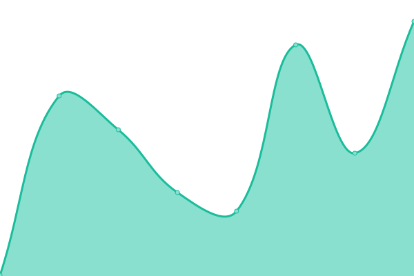

# Uptime and Status Tracker

This repository contains the open-source uptime monitor and status page for [some personal sites](https://tomichen.com/), powered by [Upptime](https://github.com/upptime/upptime).

<!--start: status pages-->
<!-- This summary is generated by Upptime (https://github.com/upptime/upptime) -->
<!-- Do not edit this manually, your changes will be overwritten -->
<!-- prettier-ignore -->
| URL | Status | History | Response Time | Uptime |
| --- | ------ | ------- | ------------- | ------ |
|  [Personal Site](https://tomichen.com/) | 🟩 Up | [personal-site.yml](https://github.com/tctree333/status/commits/HEAD/history/personal-site.yml) | 

 142ms
     
 | 

<a href="https://status.tomichen.com/history/personal-site">100.00%</a>
    

|  [Tools Site](https://tools.tomichen.com/) | 🟩 Up | [tools-site.yml](https://github.com/tctree333/status/commits/HEAD/history/tools-site.yml) | 

 451ms
     
 | 

<a href="https://status.tomichen.com/history/tools-site">99.83%</a>
    

|  [Duosmium Results](https://www.duosmium.org/results/) | 🟩 Up | [duosmium-results.yml](https://github.com/tctree333/status/commits/HEAD/history/duosmium-results.yml) | 

 188ms
     
 | 

<a href="https://status.tomichen.com/history/duosmium-results">100.00%</a>
    

|  [SciOly-ID](https://sciolyid.org/) | 🟩 Up | [sci-oly-id.yml](https://github.com/tctree333/status/commits/HEAD/history/sci-oly-id.yml) | 

 556ms
     
 | 

<a href="https://status.tomichen.com/history/sci-oly-id">100.00%</a>
    

|  [Bird-ID API](https://orni-api.sciolyid.org/) | 🟩 Up | [bird-id-api.yml](https://github.com/tctree333/status/commits/HEAD/history/bird-id-api.yml) | 

 297ms
     
 | 

<a href="https://status.tomichen.com/history/bird-id-api">100.00%</a>
    

|  [Minerobo API](https://minerobo.sciolyid.org/) | 🟩 Up | [minerobo-api.yml](https://github.com/tctree333/status/commits/HEAD/history/minerobo-api.yml) | 

 261ms
     
 | 

<a href="https://status.tomichen.com/history/minerobo-api">100.00%</a>
    

|  [Capital Fish](https://capitalfish.tomichen.com/) | 🟩 Up | [capital-fish.yml](https://github.com/tctree333/status/commits/HEAD/history/capital-fish.yml) | 

 283ms
     
 | 

<a href="https://status.tomichen.com/history/capital-fish">100.00%</a>
    

|  [Fun With Meth](https://funwithmeth.com/) | 🟩 Up | [fun-with-meth.yml](https://github.com/tctree333/status/commits/HEAD/history/fun-with-meth.yml) | 

 217ms
     
 | 

<a href="https://status.tomichen.com/history/fun-with-meth">100.00%</a>
    

|  [Stop Big Boba](https://stopbigboba.com/) | 🟩 Up | [stop-big-boba.yml](https://github.com/tctree333/status/commits/HEAD/history/stop-big-boba.yml) | 

 135ms
     
 | 

<a href="https://status.tomichen.com/history/stop-big-boba">100.00%</a>
    

|  [Why Are You Awake](https://whyareyouawake.com/) | 🟩 Up | [why-are-you-awake.yml](https://github.com/tctree333/status/commits/HEAD/history/why-are-you-awake.yml) | 

 110ms
     
 | 

<a href="https://status.tomichen.com/history/why-are-you-awake">100.00%</a>
    

|  [Is Cancelled](https://iscancelled.com/) | 🟩 Up | [is-cancelled.yml](https://github.com/tctree333/status/commits/HEAD/history/is-cancelled.yml) | 

 715ms
     
 | 

<a href="https://status.tomichen.com/history/is-cancelled">100.00%</a>
    

|  [Twemoji Explorer](https://twemoji.tomichen.com/) | 🟩 Up | [twemoji-explorer.yml](https://github.com/tctree333/status/commits/HEAD/history/twemoji-explorer.yml) | 

 230ms
     
 | 

<a href="https://status.tomichen.com/history/twemoji-explorer">100.00%</a>
    

<!--end: status pages-->

## 📄 License

- Powered by: [Upptime](https://github.com/upptime/upptime)
- Code: [MIT](./LICENSE) © [Tomi Chen](https://tomichen.com/)
- Data in the `./history` directory: [Open Database License](https://opendatacommons.org/licenses/odbl/1-0/)
